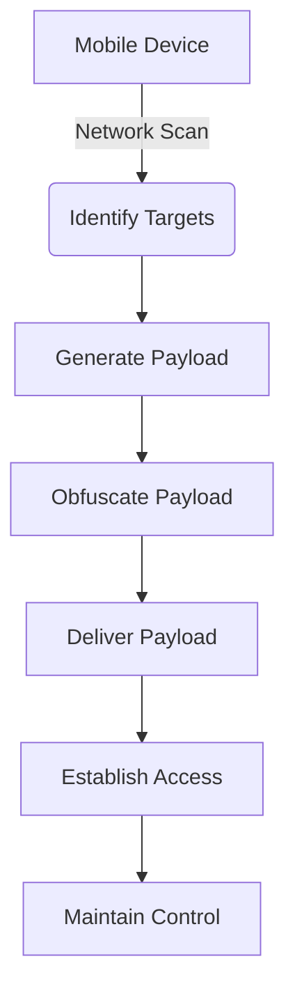

# Mobile Pentest - Android Offensive Toolkit

## Immediate Offensive Capabilities from Your Android Device

### Core Offensive Features
- **Network Scanning**: Fast TCP port scanning with service detection
- **Reverse Shell Generation**: Immediate payload generation for remote access
- **Payload Obfuscation**: Base64 encoding for evasion
- **Mobile Offensive Platform**: Run penetration tests from your Android phone

### Immediate Offensive Usage

#### 1. Network Reconnaissance
1. Enter target IP (e.g., 192.168.1.1)
2. Enter port range (e.g., 1-1000 or 21,22,80,443)
3. Tap "Scan Network"
4. View open ports and vulnerable services

#### 2. Reverse Shell Generation
1. Enter your listener IP (attack machine)
2. Enter listener port (e.g., 4444)
3. Tap "Generate Reverse Shell"
4. Copy the generated payload for delivery

#### 3. Payload Obfuscation
1. Generate a reverse shell
2. Tap "Obfuscate Payload"
3. Copy the obfuscated payload for evasion

### Offensive Workflow


### Listener Setup
On your attack machine:
```bash
nc -lvnp 4444
```

### Build Instructions
1. Install Android Studio
2. Open this project
3. Build APK (Build > Build Bundle(s) / APK(s) > Build APK)
4. Install on your Android device

### Immediate Offensive Results
This mobile penetration toolkit provides immediate offensive capabilities from your Android device, including:

- **Network scanning** for target identification
- **Reverse shell generation** for immediate access
- **Payload obfuscation** for evasion
- **Mobile offensive platform** for on-the-go penetration testing

**Note**: This toolkit is for authorized security testing only. Use responsibly and only on systems you have explicit permission to test.
